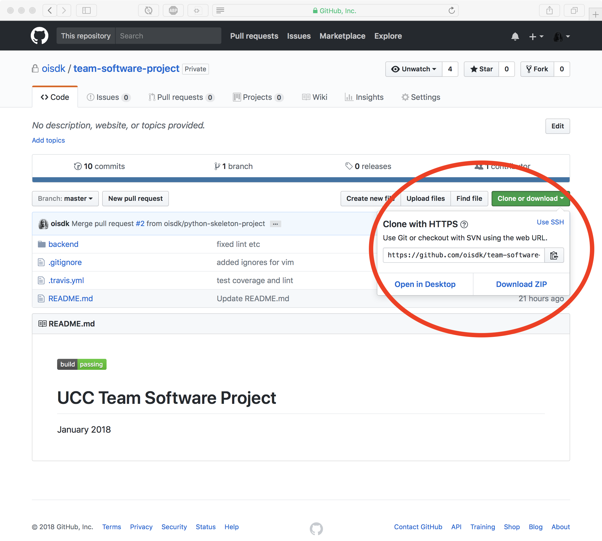
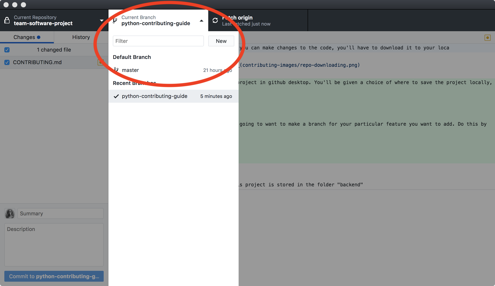
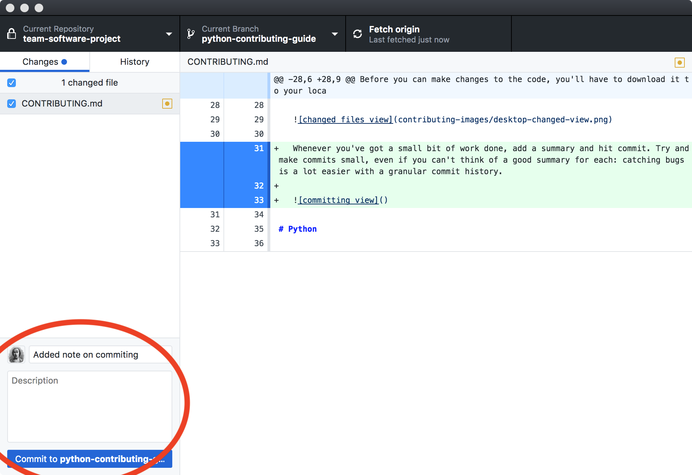
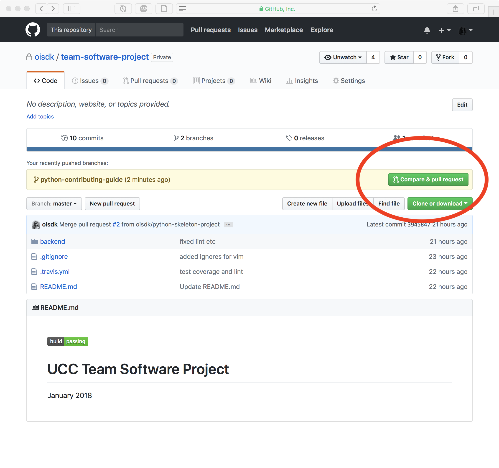

# Downloading the project and making changes

Before you can make changes to the code, you'll have to download it to your local machine so you can open it up in your editor. If you're already familiar with git and github, all you need to know is: don't make commits to master. Make a branch, commit on there, and make a pull request back to master. If you're not familiar, here's a short guide:

1. Download and install [github desktop](https://desktop.github.com).

   In theory, you can do all of this stuff from the command line, but it's a total headache and github desktop makes it much easier. There's also a lot of github-specific conventions that are difficult to remember (how does github handle rebasing? how exactly are commits squashed?). If you know what you're doing, feel free to ignore all the github-specific stuff, but "there be dragons" etc.

2. Download the repository.

   Go to [the main page for the repo](https://github.com/oisdk/team-software-project) and click the green button marked "clone or download", and then click "open in desktop"

   

   This should open the project in github desktop. You'll be given a choice of where to save the project locally, and it'll download.

3. Make a branch.

   At this point, you're going to want to make a branch for your particular feature you want to add. Do this by opening github desktop, selecting the project, and clicking the "current branch" menu, and then "new":

   

   Name your branch after the feature you're adding.

4. Commit to the new branch.

   Now, whenever you make changes to the project, they'll show up in green in the main pane on the right. For instance, while writing this guide, this is what the window looks like:

   

   Whenever you've got a small bit of work done, add a summary and hit commit. Try and make commits small, even if you can't think of a good summary for each: catching bugs is a lot easier with a granular commit history.

   

5. Push to remote.

   Periodically, you can hit "push" in the top-right:

   

   This will sync your branch with the copy on github's servers.

6. Make a pull request.

   Back on the project's web page, you can select "compare and pull request".

   

   From here, you can add a short description of the pull request.

7. Code review and changes.

   Once you've made your pull request, you can still make changes to the branch it comes from. These will be added to the pull request.

8. Merge.

   Once you're happy that you've addressed everything in the code review, and all the checks have passed, you can merge your code into master.

9. Delete your branch.

   Don't forget to delete your branch after it was merged!

# Continuous Integration

Before any code can be merged into master, a remote server will try and load and test it. The remote server is wiped before every build, and then the configuration file (`.travis.yml`) is run. This is the current (simplified) contents of `.travis.yml`:

```yaml
matrix:
  include:
    - language: python
      python: 3.5
      install:
        - pip install -r backend/requirements.txt
        - pip install pylint
        - pip install coverage
        - pip install flake8
      before_script:
        - cd backend
      script:
        - flake8 ./
        - pylint backend
        - coverage run --source backend -m unittest discover
        - coverage report
    - language: node_js
      node_js: 7
      install:
        - cd frontend
        - npm install
        - cd ..
      before_script:
        - cd frontend
      script:
        - npm test
```

If you're having trouble compiling or running the project locally, you can follow the configuration above, and you should get it to work. For instance, to get the Python backend to test, you might first check that you're running Python 3.5, cd into the project's main folder (`team-software-project`), and then run the commands:

```
pip install -r backend/requirements.txt
pip install pylint
pip install coverage
pip install flake8
cd backend
flake8 ./
pylint backend
coverage run --source backend -m unittest discover
coverage report
```

# Python

## Python Code Structure

The Python backend is structured as a package, called `backend`. It's stored in the `backend` folder, which has the contents:

* README.rst

  Just a readme for the package. We won't be using this, but pip prefers when it's included.

* requirements.txt

  This file contains a list of any libraries that the backend needs. If you need to use a library, just put the name of the library in here on a new line. (you don't need to include libraries here if they're in the standard library)

* setup.py

  This is a standard Python setup file. It contains details of the package, and entry points. You shouldn't need to edit this.

* .coveragerc

  This is a configuration file for code coverage. Basically, it contains a percentage (currently 90%), which is the code coverage requirement. If less than that percent of code is covered by tests, the continuous integration will fail.

* pages.py

  This contains a single dictionary, which contains a list of the pages generated by the backend.

* tests/

  Contains the tests for the backend.

* backend/

  Contains the actual Python package that comprises the backend. All Python code (except tests) should go in here.

## Getting Python Code on the Server

So how does the Python code eventually end up on the server? Because of constraints to do with what can and can't be installed on the server, we're using *entry points*. Let's say we want to serve a simple page with the text "this is an example". The Python code to do that might look like this (in `backend/example.py`):

```python
"""an example"""


def example():
    """serves an example web page

    >>> example()
    Content-Type: text/html
    <BLANKLINE>
    <!DOCTYPE html>
    <html lang="en">
    <head><title>Example</title></head>
    <body>this is an example</body>
    </html>
    """
    print('Content-Type: text/html')
    print()
    print("""<!DOCTYPE html>
<html lang="en">
<head><title>Example</title></head>
<body>this is an example</body>
</html>""")
```

Notice how we're wrapping it in a function.

To turn the above into a page we can visit, we need to edit the `pages.py` file (in `team-software-project/backend/pages.py`). It contains a dictionary with a list of the pages in the end result, and the functions they correspond to. After adding just this example, the file looks like:

```python
pages = {
    'example': 'backend.example:example',
}
```

The key is the name of the page, and the value is the module name, followed by a colon, followed by the name of the function we want to call.

This will generate a page accessible at `cs1.ucc.ie/~dok4/cgi-bin/example.py`.

## Passing the Continuous Integration

### Linter

We're using [flake8](http://flake8.pycqa.org/en/latest/) and [pylint](https://www.pylint.org). They enforce a standard style, and catch a lot of small bugs that might be in the code. To run them locally, make sure you have them installed (`pip install flake8 pylint`), and run them from `team-software-project/backend/` with the command `flake8 ./ && pylint backend`. They will then run over your code, looking for common errors and so on. As an example, let's take the file from earlier:

```python
"""an example"""


def example():
    """serves an example web page

    >>> example()
    Content-Type: text/html
    <BLANKLINE>
    <!DOCTYPE html>
    <html lang="en">
    <head><title>Example</title></head>
    <body>this is an example</body>
    </html>
    """
    print('Content-Type: text/html')
    print()
    print("""<!DOCTYPE html>
<html lang="en">
<head><title>Example</title></head>
<body>this is an example</body>
</html>""")
```

Let's change it, by adding a useless statement in the middle:


```python
"""an example"""


def example():
    """serves an example web page

    >>> example()
    Content-Type: text/html
    <BLANKLINE>
    <!DOCTYPE html>
    <html lang="en">
    <head><title>Example</title></head>
    <body>this is an example</body>
    </html>
    """
    print('Content-Type: text/html')
    x = 4
    print()
    print("""<!DOCTYPE html>
<html lang="en">
<head><title>Example</title></head>
<body>this is an example</body>
</html>""")
```

We'll get the warning:

```
./backend/example.py:17:5: F841 local variable 'x' is assigned to but never used
```

To fix your code, remove the assignment.

### Tests

If your code changes the behaviour of other code which has tests in the project, the previous tests will need to pass. To run previous tests, cd into `team-software-project/backend/` and run:

```
python -m unittest discover
```

If your code breaks any tests, you'll need to fix them before it can be merged to master.

### Coverage

Another requirement for continuous integration is that most of the code is covered by tests. To see the coverage level, run:

```
coverage run --source backend -m unittest discover
coverage report
```

This runs the tests from within a program what monitors what source code is executed. Currently, code needs to be 90% covered to be merged into master.

To add tests to your code, you've got 2 options:

1. Using doctest

   If your tests are simple and example-based, you can include them in the docstring for your new code and they'll automatically be run when testing. For example:

   ```python
   def double(x):
       """Returns the double of some number.

       >>> double(3)
       6

       >>> double(4)
       8
       """
       return x + x
   ```

   These tests are great for documentation and helping others understand your code, but they might not be enough to fully test every corner-case.

   More information on doctest and the syntax for different kinds of tests is available at its [documentation page](https://docs.python.org/3.5/library/doctest.html).

2. Using unittest

   Every module will have a corresponding test file in the tests folder. Test files are just the name of the module file prefixed with `test_`. In this file, you'll need to add a new testing method to test the functionality of your code. Information on how to do this is available at [unittest's documentation page](https://docs.python.org/3.5/library/unittest.html).

## Adding a Dependency

If your code imports a library that isn't in the standard library and wasn't already added as a requirement to the project, you'll need to add the name of that library to the requirements.txt file. Just the name of the library is fine, on a new line, with no other information.

## Adding a New Module

New modules go in `team-software-project/backend/backend/`. When adding a new module, you'll need to add a corresponding test file in the tests folder. There's a little bit of fiddliness to get this to work correctly, so here's an example. Say we want to create a module called "new". We create a file `new.py` in `team-software-project/backend/backend/`. It might look like this:

```python
"""This is a new module"""


def double(x):
    """Returns the double of some number.

    >>> double(3)
    6

    >>> double(4)
    8
    """
    return x + x
```

Notice that you need a docstring for the module, otherwise the linter will fail.

Now, in `team-software-project/backend/tests/`, create a file `test_new.py`, with this basic template:

```python
import unittest
import doctest
import backend.new


class TestNew(unittest.TestCase):
    def test_double(self):
        self.assertEqual(backend.new.double(2), 4)


def load_tests(loader, tests, ignore):
    tests.addTests(doctest.DocTestSuite(backend.new))
    return tests


if __name__ == '__main__':
    unittest.main()
```

You can organize the tests however you want, with test cases and subtests and so on, but unfortunately the `load_tests` function is necessary to run the doctests in the new module. Notice also that in the line `tests.addTests(doctest.DocTestSuite(backend.new))` you pass the name of the new module. It's easy to accidentally pass the name of another module here, so be careful when copying and pasting the above template.

# Javascript and Frontend

## Structure

The frontend for the app is divided into 4 folders:

1. Javascript files go in `frontend/app/`

2. HTML files go in `frontent/html/`

3. CSS files go in `frontend/css/`

4. Assets (images, etc) go in `frontend/assets/`

   (the folder `frontend/assets/` might not exist in the repository if no-one has put anything in it yet. This isn't a bug: github doesn't sync empty folders. If you need to add an asset, and the folder isn't there, just go ahead and create it, everything else should be handled for you.)

All of the contents of these folders will be copied into the actual web page when deployed. That means that references in HTML should assume everything is in the same folder.

The main JavaScript file is `frontend/app/index.js`. You can think of this as the file that's imported in the script tag in the header of `index.html`. In reality, it will be transpiled and compressed, and put in a single file called `bundle.js`, next to `index.html` in the final website. We import this in the HTML will the tag:

```html
<script src="bundle.js"></script>
```

Similarly, all css will be stuck into one file, called `styles.css`, which is imported with:

```html
<link rel="stylesheet" href="styles.css">
```

For example, the basic `index.js` looks like this:

```javascript
import * as random from './random';

window.onload = function setWithRandom() {
    document.body.innerHTML += random.getRandomNumber();
};
```

And this generates a web page (at `cs1.ucc.ie/~dok4`) with the content "4".

## Installing and Serving Locally

To run the tests and serve a static version of the frontend locally, you'll need to install 2 things first:

1. [node.js](https://nodejs.org/en/)

2. [npm](https://www.npmjs.com)

The site won't be using either of these programs: they're just to allow for testing, linting, and transpiling.

Once they're both installed, cd into the frontend folder, and run:

```bash
npm install
```

This will install everything you need to test and run the site.

To make a static version of the site, run:

```bash
npm start
```

Then you can open the file `frontend/dist/index.html` and you will see what the site should look like.

## Making Changes to the JavaScript

All JavaScript in this project is ES6. Sticking to one standard makes it easier to learn and lookup documentation, and since it's transpiled to an older version you don't have to worry about which browser supports what. Just follow some guide for ES6 and you should be good to go.

In this version there are some differences from other versions of JavaScript out there that you might have used ([this](http://es6-features.org/) page has a good summary), but here are a couple that were most important:

1. Imports and Exports

   Let's look at two files in the folder `frontend/app/`. `frontend/app/random.js`:

   ```javascript
   export function getRandomNumber() {
       return 4;
   }

   export function getAnotherRandomNumber() {
       return 4;
   }
   ```

   and `frontend/app/index.js`:

   ```javascript
   import * as random from './random';

   window.onload = function setWithRandom() {
       document.body.innerHTML += random.getRandomNumber();
   };
   ```

   The `random.js` file exports a single function: this is done by prefixing it with the `export` keyword. In the `index.js` file, we import everything (`*`), name it `random` (if we had named it, for instance `numbers`, the function call would be `numbers.getRandomNumber()`), and give the location of the file we're importing from. (**NB**: if you're importing from a library, the path will be `../node_modules/library_name`).

   Alternatively, we could have not named the import, and specified what function we wanted to import:

   ```javascript
   import { getRandomNumber } from './random';

   window.onload = function setWithRandom() {
       document.body.innerHTML += getRandomNumber();
   };
   ```

2. `const` and `let`

   If you create a variable that doesn't get mutated, you can use the `const` keyword (rather than `var` or `let`) to create it. This will make sure that you don't mutate it. For instance:

   ```javascript
   function addFourTo(n) {
       var result = n + 4;
       return result;
   }
   ```

   In this case, the `result` variable is never mutated, so you can instead use `const`:

   ```javascript
   function addFourTo(n) {
       const result = n + 4;
       return result;
   }
   ```

   The `let` keyword can be used to declare a variable that is scoped to the enclosing block, rather than the enclosing function (which is what `var` does). More info [here](https://developer.mozilla.org/en-US/docs/Web/JavaScript/Reference/Statements/let).

## Passing The Continuous Integration

All of the continuous integration tests on the frontend can be performed by cding into `team-software-project/frontend/`, and running:

```bash
npm test
```

This will run the linter, tests, and coverage checks.

### Linter

If the linter fails, the first thing to try is to automatically fix your code. You can do this by running:

```bash
npm run-script fix
```

For instance, in the example above:

```javascript
function addFourTo(n) {
    var result = n + 4;
    return result;
}
```

The linter will change it to the proper form automatically.

### Tests

We're using the [Jest](https://facebook.github.io/jest/) testing framework. It's run along with `npm test`. Every JavaScript file should be accompanied by a test file (in the same directory): if your file is called `example.js`, its test file is `example.test.js`. One thing to watch out for with Jest is that the examples are written in the node.js style of imports (using `require`), but you'll use the ES6 style (`import ... as ... from ...`).

In the example for random numbers, this is the test file (in `frontend/app/random.test.js`):

```javascript
import * as random from './random';

describe('getRandomNumber', () => {
    it('should be 4', () => {
        expect(random.getRandomNumber()).toBe(4);
    });
});

describe('geAnothertRandomNumber', () => {
    it('should be 4', () => {
        expect(random.getAnotherRandomNumber()).toBe(4);
    });
});
```

### Adding a Dependency

If you need a library for the JavaScript portion of the project, you can add it by cding into `team-software-project/frontend/` and running:

```bash
npm install library_name --save
```

Then, to import it from a file, you'll need to import from the `node_modules` folder. For instance, in `team-software-project/frontend/app/random.js`:

```bash
import * as library_name from "../node_modules/library_name";
```

# HTML

Bootstrap divides page into divs with unique ids. Example: content-left. Place html file that will be used into team-software-project/frontend/html. When adding html to screen use:

```javascript
document.getElementById(div-id).innerHTML = generated-html;
```
where _div-id_ is the id of the div element to add content to (e.g. 'content', 'content-left') and _generated-html_ is the html file.

Detailed example modified from generateCreateJoinPage.js:

Function to update page.
```javascript
export function updatePage(fileReader) {
    if (fileReader.status === 200 && fileReader.readyState === 4) {
        document.getElementById('content').innerHTML = fileReader.responseText;
    }
}
```

Function to read html file.
```javascript
export function generateHTML() {
    const fileReader = new XMLHttpRequest();
    fileReader.open('GET', 'example.html', true);
    fileReader.onreadystatechange = () => updatePage(fileReader);
    fileReader.send();
}
```

# Database Organisation

## How-To: Accessing Database from Docker
1. Start Docker: `docker start monopoly`
2. Log into the Docker shell: `docker exec -it monopoly bash`
3. Start the MySQL interpreter: `mysql db`
4. Type: `show tables;` to get a list of all tables in the database.
5. Type: `describe X;` where "X" is the table you want to the fields in.
6. To see what's actually stored in the database, do the usual SQL stuff (e.g. `select * from games;`)

## Current Tables in the Database
| Tables       |
| ------------ |
| games        |
| players      |
| playing_in   |
| rolls        |

## Table Structures
### "games"
| Field        | Type                      | Null | Key | Default | Extra          |
|--------------|---------------------------|------|-----|---------|----------------|
| id           | int(10) unsigned          | NO   | PRI | NULL    | auto_increment |
| state        | enum('waiting','playing') | NO   |     | waiting |                |
| current_turn | tinyint(3) unsigned       | NO   |     | 0       |                |

### "players"
| Field          | Type                | Null | Key | Default | Extra          |
|----------------|---------------------|------|-----|---------|----------------|
| id             | int(10) unsigned    | NO   | PRI | NULL    | auto_increment |
| username       | varchar(255)        | NO   |     | NULL    |                |
| balance        | int(11)             | NO   |     | 200     |                |
| turn_position  | tinyint(4)          | YES  |     | 0       |                |
| board_position | tinyint(3) unsigned | NO   |     | 0       |                |

### "playing_in"
| Field     | Type             | Null | Key | Default | Extra |
|-----------|------------------|------|-----|---------|-------|
| player_id | int(10) unsigned | NO   | MUL | NULL    |       |
| game_id   | int(10) unsigned | NO   | MUL | NULL    |       |

### "rolls"
| Field | Type                | Null | Key | Default | Extra |
|-------|---------------------|------|-----|---------|-------|
| id    | int(10) unsigned    | NO   | MUL | NULL    |       |
| roll1 | tinyint(3) unsigned | NO   |     | NULL    |       |
| roll2 | tinyint(3) unsigned | NO   |     | NULL    |       |
| num   | int(10) unsigned    | NO   |     | NULL    |       |

## Glossary
| Term | Meaning                                                                  | Link to relevant MySQL Docs                               |
|-----|---------------------------------------------------------------------------|-----------------------------------------------------------|
| PRI | Primary key: Uniquely identifies each record in the table. Cannot be NULL | https://dev.mysql.com/doc/refman/5.7/en/glossary.html     |
| MUL | A bit like the opposite of PRI, allows multiple occurrences of same value | https://dev.mysql.com/doc/refman/5.7/en/show-columns.html |
