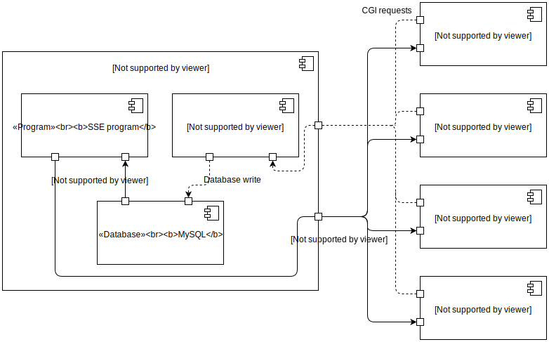

# UCC Team Software Project 2018

Team 2

Available [here](http://54.186.226.199).

For instructions on how to add your code etc., see CONTRIBUTING.md

# Table of Contents

## Database TOC
* [Access Database from Docker](#how-to-accessing-database-from-docker)
* [Current Tables in Database](#current-tables-in-the-database)
* [Table Structures](#table-structures)
* [Glossary](#glossary)

# Database Organisation

## How-To: Accessing Database from Docker
1. Start Docker: `docker start monopoly`
2. Log into the Docker shell: `docker exec -it monopoly bash`
3. Start the MySQL interpreter: `mysql db`
4. Type: `show tables;` to get a list of all tables in the database.
5. Type: `describe X;` where "X" is the table you want to the fields in.
6. To see what's actually stored in the database, do the usual SQL stuff (e.g. `select * from games;`)

## Current Tables in the Database
| Tables       |
| ------------ |
| games        |
| players      |
| playing_in   |
| rolls        |

## Table Structures
### "games"
| Field        | Type                      | Null | Key | Default | Extra          |
|--------------|---------------------------|------|-----|---------|----------------|
| id           | int(10) unsigned          | NO   | PRI | NULL    | auto_increment |
| state        | enum('waiting','playing') | NO   |     | waiting |                |
| current_turn | tinyint(3) unsigned       | NO   |     | 0       |                |

### "players"
| Field          | Type                | Null | Key | Default | Extra          |
|----------------|---------------------|------|-----|---------|----------------|
| id             | int(10) unsigned    | NO   | PRI | NULL    | auto_increment |
| username       | varchar(255)        | NO   |     | NULL    |                |
| balance        | int(11)             | NO   |     | 200     |                |
| turn_position  | tinyint(4)          | YES  |     | 0       |                |
| board_position | tinyint(3) unsigned | NO   |     | 0       |                |

### "playing_in"
| Field     | Type             | Null | Key | Default | Extra |
|-----------|------------------|------|-----|---------|-------|
| player_id | int(10) unsigned | NO   | MUL | NULL    |       |
| game_id   | int(10) unsigned | NO   | MUL | NULL    |       |

### "rolls"
| Field | Type                | Null | Key | Default | Extra |
|-------|---------------------|------|-----|---------|-------|
| id    | int(10) unsigned    | NO   | MUL | NULL    |       |
| roll1 | tinyint(3) unsigned | NO   |     | NULL    |       |
| roll2 | tinyint(3) unsigned | NO   |     | NULL    |       |
| num   | int(10) unsigned    | NO   |     | NULL    |       |

## Glossary
| Term | Meaning                                                                  | Link to relevant MySQL Docs                               |
|-----|---------------------------------------------------------------------------|-----------------------------------------------------------|
| PRI | Primary key: Uniquely identifies each record in the table. Cannot be NULL | https://dev.mysql.com/doc/refman/5.7/en/glossary.html     |
| MUL | A bit like the opposite of PRI, allows multiple occurrences of same value | https://dev.mysql.com/doc/refman/5.7/en/show-columns.html |

# Communication Structure

## Component & Connector View

This diagram shows a component & connector view of the system:

Clients send requests to apache, which runs the corresponding CGI scripts. These scripts interact with a database and send back a response.

Clients also initialise a Server-sent Events event stream. This starts a script running on the server which polls the database for changes – it sends events back to the client for any changes it finds.

Since the SSE script[^thread-note] is constantly polling, most CGI scripts don’t require a response, and so mostly write to the database, rather than reading from it.

[^thread-note]: This is slightly misleading, as it suggests that there is only one SSE program running. Actually, each client gets its own thread, but they are all running the same program. The client can pass data (e.g. an id) to the SSE script through the query string so that it can act differently for each client.
