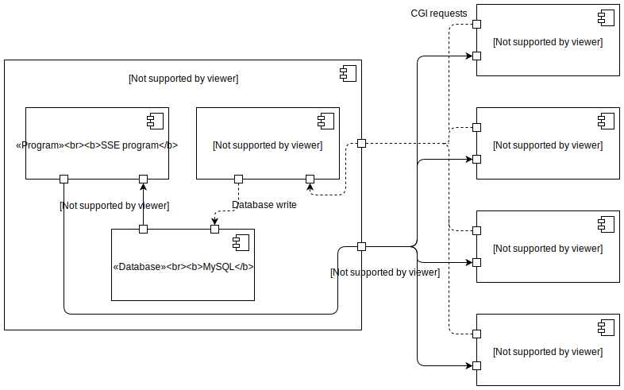
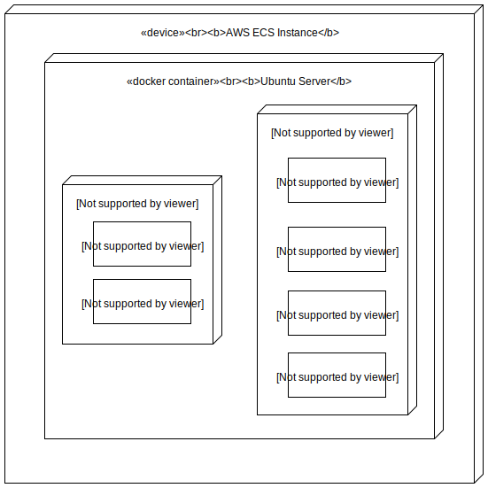

---
title: Readme
...

[](https://travis-ci.org/oisdk/team-software-project)

# Intro

## Overview

This is Team 2’s project as part of the CS3305 module in 2018, which is an online version of Monopoly. You can access a live version of this application [here](http://54.186.226.199).

## Audience and Document Scope

This document is part of the larger documentation associated with this project. It is intended to give a high-level overview of the project, targeted at developers new to the project, and at developers currently involved.

### Other Documentation

For a guide on how to use the application, targeted at end-users, see [the usage document](USAGE.md).

For a more detailed guide on how to get involved and contribute to the project, see [the contributing document](CONTRIBUTING.md).

#### `make_docs` Script

The script `make_docs.sh`, located at the repository root, converts the markdown documentation to pdf format, and generates some additional documentation (in html format) from the jsdoc comments and docstrings in the codebase.

Several things are required to be installed for this script to run successfully. At the top level, you need the following:

- pandoc (https://pandoc.org/)
- jsdoc (https://github.com/jsdoc3/jsdoc)
- pydoc (should be installed with python)

As well as that, however, pandoc requires a few other things to be installed:

- latex
- pdflatex
  * Pandoc can be run with alternative pdf engines if you need, but you’ll have to modify the script.
- rsvg2pdf
  * This is needed for converting the svg images we’ve used. On macOS you can use [homebrew](https://brew.sh/):

    ```bash
    brew install librsvg
    ```
   
    I think Linux is similar, with whatever your package manager is.

## Repository Structure

The repository is broken down into two sub-sections:

- [frontend](/frontend): client-side code

    * This is structured as a node package. For more info, see [the frontend readme](frontend/README.md).

- [backend](/backend): server-side code

    * This is structured as a python package. For more info, see [the backend readme](backend/README.rst).

# Application Structure

The application is structured as a standard web application – game state is stored on a server, to which players’ clients (browsers) connect via HTTP.

## Application Distribution

1. A client requests the initial page from the server via HTTP.

2. The server responds with the page, which includes a javascript program.

3. This javascript program handles client interaction and communicates with the server, and updates the client’s screen in response to changes.

# Communication Structure

The following diagram shows a component & connector view of the system:



There are two main information flows:

1. Clients send requests to apache (represented by dashed lines in the diagram), which runs the corresponding CGI scripts. These scripts interact with a database and send back a response.

2. Clients also initialise a Server-sent Events event stream (represented by a solid line in the diagram). This starts a script running on the server which polls the database for changes – it sends events back to the client for any changes it finds.

Since the SSE script[^threadnote] is constantly polling, most CGI scripts don’t require a response (except possibly an acknowledgement), and so mostly write to the database, rather than reading from it.

[^threadnote]: This is slightly misleading, as it suggests that there is only one SSE program running. Actually, each client gets its own thread, but they are all running the same program. The client can pass data (e.g. an id) to the SSE script through the query string so that it can behave differently for each client.

# Deployment Structure

The following diagram shows a deployment view of the project:


