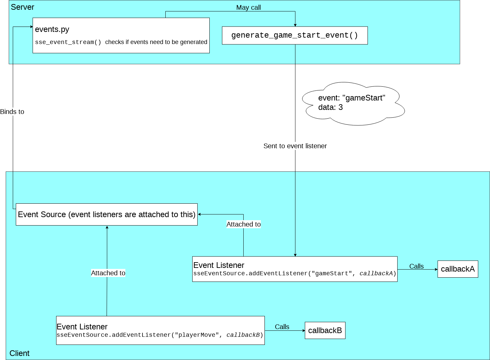

# Monopoly Frontend

|             Table of Contents             |
| ----------------------------------------- |
| [Server-Sent Events](#server-sent-events) |


## Server-Sent Events

### What They are
They're essentially a means for a server to send data to a client **without**
the client having to make any requests.

#### How it Works (from a brief implementation perspective)
1. The client makes an **event listener**, just like any ol' event listener
(click, mouseover, keypress, etc.).
2. The server sends the event (which has the **same name** as what the client
is listening for) to standard output along with data (which can be something
like a bit of JSON).
3. The client will receive this event and trigger the event callback.

#### Diagram


### How to Write a Client-Side SSE Listener
1. In your JavaScript code, add the following import statement:

   `import {getEventSource} from './sse';`

2. In your JavaScript code, get a reference to the event source:

   `const sseEventSourceReference = getEventSource();`

   **Note**: The event source is like a _path_ from the server to the
   client through which events will travel.

   **Also note**: The event source (which is a class, by the way) is
   initialised by waitingGame() already, therefore, there's no need to
   re-initialise it again, all you have to do is "get" the event source, as
   per the step above.

3. Now attach an event listener to the event source:

   e.g.

   `mySseEventSource.addEventListener("gameStart", myCallback)`

   **Note**: The event type will vary depending on the event type that will be
   sent by the server. In this example, the event type is "gameStart".
   Other types used in this project include "playerMove" and "playerJoin".

   If you created a server-side event generator in events.py, then you know
   what the event type is. If you're receiving events from someone else's
   server-side event generator, then find out what event type their code
   generates by looking up events.py (or just ask them in person :smiley:).

4. In your callback function, do whatever you want with the data that was
   send by the server.

   e.g.

   ```javascript
   mySseEventSource.addEventListener('gameStart', (myEventData) => {
       const theData = myEventData.data;
       // Do something with 'theData'
   });
   ```
   Note that in some cases the server will send "data" in **JSON format**
   (i.e. generate_player_join_event), therefore, you'll need to **parse**
   the event "data" in the client code.

   e.g.

   ```javascript
   mySseEventSource.addEventListener('...', (myEventData) => {
       const theData = JSON.parse(myEventData.data);
       // Do something with 'theData'
   });
   ```
